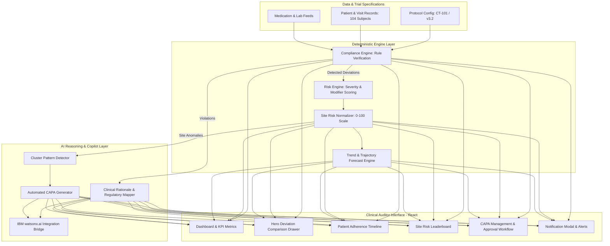

# Architecture

## System Architecture

TrialGuard AI adopts a decoupled, deterministic-first architecture where objective compliance evaluation is isolated from AI narrative reasoning.

## Components

| Component | Technology | Responsibility |
|---|---|---|
| **Compliance Engine** | Pure JavaScript (`src/logic/complianceEngine.js`) | Evaluates visit windows, dosage, prohibited conmeds, and safety labs against protocol specifications deterministically. |
| **Risk Engine** | Pure JavaScript (`src/logic/riskEngine.js`) | Computes patient risk, applies recurrence modifiers (+5 repeat, +5 multi-category), and normalizes site risk to a 0–100 scale. |
| **Trend & Forecast Engine** | Pure JavaScript (`src/logic/trendEngine.js`) | Calculates historical deviation velocity and transparently estimates 30-day projected site risk trajectory. |
| **Explanation Engine** | Pure JavaScript (`src/logic/explanationEngine.js`) | Maps deviation facts to ICH GCP E6(R2) and FDA 21 CFR 312 citations and generates clinical significance statements. |
| **CAPA Engine** | Pure JavaScript (`src/logic/capaEngine.js`) | Synthesizes root-cause hypotheses, immediate containment, and preventative actions with mandatory human sign-off. |
| **State & Context Provider** | React Context (`src/context/TrialContext.jsx`) | Manages cohort state, deviation registries, site scores, alerts, and asynchronous "Run Compliance Analysis" workflows. |
| **User Interface** | React 18, Tailwind CSS, Lucide React | Clean, high-density enterprise clinical interface optimized for regulatory audits and CRA monitoring workflows. |
| **Data Visualizations** | Recharts (`recharts`) | High-performance deviation timeline and site risk comparison charts. |

## Data Flow

1. **Rule Registration:** Protocol parameters (visit windows, dosage bounds, prohibited conmed list, mandatory labs) are established in `protocolConfig.js`.
2. **Deterministic Evaluation:** When "Run Compliance Analysis" is executed, `evaluateCompliance()` scans each subject's visits, vitals, medications, and labs without external LLM latency or hallucination risks.
3. **Scoring & Weighting:** Each deviation receives an objective weight (Critical: 15, Major: 10, Minor: 4, Admin: 1). Patients with multiple deviations or multi-category breaches incur +5 risk modifiers.
4. **Site Normalization:** Site scores are normalized to a 0–100 scale based on deviation point density, cohort infection proportion, and critical event density. Site 03 naturally emerges as highest risk.
5. **Pattern Clustering & CAPA Generation:** Recurrent violation patterns (e.g., visit window delays at Site 03, or prohibited medication ingestion) automatically trigger draft CAPA records flagged with `Human Review Required`.
6. **Auditor Action & Approval:** The CRA reviews the Hero Element (Protocol Requirement vs Actual Data), inspects the affected patient timeline, and either approves or revises the CAPA.

## Security & Regulatory Considerations

- **FDA 21 CFR Part 11 Audit Trail:** Every analysis execution, deviation inspection, and CAPA approval generates a timestamped, tamper-evident audit trail record.
- **ICH GCP E6(R2) Section 5.18 Compliance:** Automated monitoring supports Risk-Based Monitoring (RBM) guidelines by prioritizing investigation sites with statistically elevated deviation velocity.
- **Subject De-Identification (HIPAA / GDPR):** All synthetic subjects are referenced via pseudonymous codes (e.g. `PT-1042`). No protected health information (PHI) is ever exposed.

## Scalability & Backend Integration

While this prototype runs an optimized client-side deterministic engine, the architecture is structured for seamless migration to a distributed enterprise deployment:
- **FastAPI / Python Backend:** The logic in `src/logic/` directly maps to Python Pydantic models and SQLAlchemy schemas.
- **IBM watsonx.ai Foundation Models:** Narrative synthesis in `explanationEngine.js` and `capaEngine.js` can connect to `ibm/granite-13b-instruct` via the Python SDK for enterprise-scale document generation.
- **FHIR / HL7 Ingestion:** EDC feeds from Medidata Rave or Veeva Vault can be ingested via standard RESTful endpoints.
